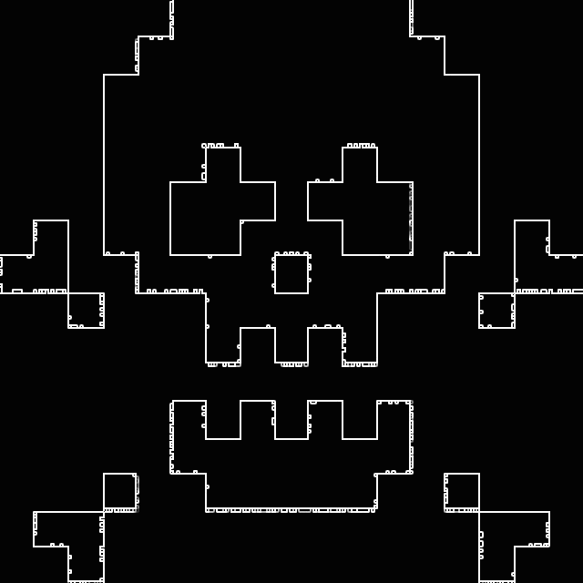

# Metastasize Malware 

Inspiration: https://en.wikipedia.org/wiki/Diffusion-limited_aggregation

I wanted to show a 8-bit spread that’s supposed to represent an aggressive malware corrupting everything while forming a generic skull which symbolize the death of a computer.

The GLSL is a Diffusion-Limited Aggregation (DLA) model. DLA is one of the most versatile model for growth pattern formation, embodying the positive feedback loops that emerge in systems as a pure consequence of their underlying chaotic behavior.
